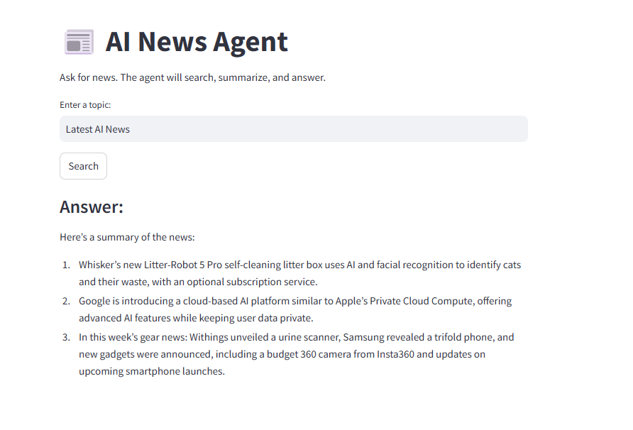

# Fetch news apis
## 1. Make sure you have a NewsAPI key
- Go to: https://newsapi.org/
- Create a free key.
## 2. Set your NewsAPI key
- Option 1 — Use .env (recommended)
```.env
NEWSAPI_KEY=your_key_here
```
## How to run it
```sh
streamlit run Agents/AgenticAI/streamlit_app.py

```

## After running, it should looks like that
