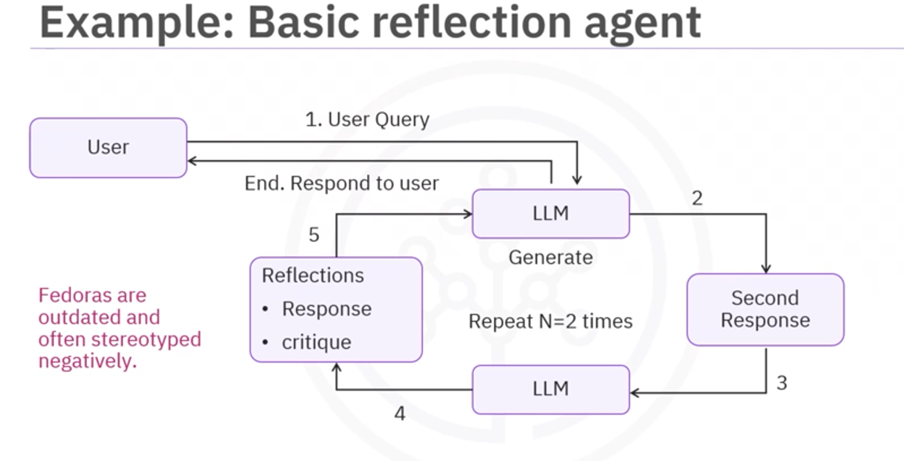

# Code Explanation of `ReflectAgent.ipynb`
## 1. Setup and Installation Cells
```python
%pip install langchain-openai==0.3.10
%pip install langgraph --upgrade
%pip install langchain_community==0.3.24

```

- These are core packages:
    - `langchain-openai`: Allows using OpenAI models via LangChain.
    - `langgraph`: Creates AI agent workflows as graphs
    (with nodes, edges, events, and looping logic).
    - `langchain_community`: Community tools (like search, tools, etc.)
    
## 2.Importing Libraries
### The notebook imports:
- `ChatOpenAI` — OpenAI LLM interface
- `MessageGraph` — builds the reflection workflow
- `HumanMessage`, `AIMessage`, `ToolMessage` — message types
- `TavilySearchResults` — search API tool

## 3. Setting Up API Key
- There is a helper function:
```python
def _set_if_undefined(var):
    if not os.environ.get(var):
        os.environ[var] = getpass.getpass(var)

```
- This ensures an API key exists.
- (You replaced with your own OPENAI_API_KEY).

## 4. Testing the LLM
- The notebook tests:
```python
llm = ChatOpenAI(model="gpt-4.1-nano")
response = llm.invoke("Any ideas for a healthy breakfast?")

```
- This confirms that the LLM works.

## 5. Adding a Search Tool — Tavily
- The agent uses:
```python
tavily_tool = TavilySearchResults(max_results=1)

```
- This gives the agent "internet lookup" ability.

### Tavily
- **What is Tavily?**
    - Tavily is a **developer-focused web search API** optimized specifically for LLMs and autonomous agents.
    - Unlike Google or Bing search APIs built for general search, Tavily is designed to:
        - Give clean, structured, LLM-friendly results
        - Focus on accuracy, information-dense summaries, and minimal noise
        - Provide RAG-friendly output for agents
- **Why Tavily Exists**
    - Traditional search engines (Google/Bing):
        - Return noisy HTML
        - Are tuned for human browsers, not LLMs
        - Provide irrelevant ads
        - Require scraping
        - Don’t return clean JSON
        - Are hard for agents to process
## 6. Define the Reflection Logic
- The notebook defines two main chains:
### (a) Respond Chain — Produce Initial Answer
- This chain uses:
```python
llm = ChatOpenAI(model="gpt-4.1-mini")

```
- Its job:
    - Read your question
    - Produce a first draft answer
    - If necessary, call `tavily_search` tool
    
### (B) Revisor Chain — Evaluate and Improve Answer
- This chain takes the answer list:
```python
response_list = [HumanMessage(...), AIMessage(...), ToolMessage(...)]

```
- Then:
    - Critiques the answer
    - Identifies hallucinations, errors, missing details
    - Generates a **revised version**

## 7. Building the Reflection Loop
- This is the core part:
```python
MAX_ITERATIONS = 4
```
- Then the event loop:
```python
def event_loop(state):
    count = len([m for m in state if isinstance(m, AIMessage)])
    if count > MAX_ITERATIONS:
        return END
    return "execute_tools"

```
- Meaning:
    - After every revision, the model decides whether to stop
    - 


## Workflow Explanation

### STEP 1 — User Query
- The user sends a question, such as:
    - “Give me fashion advice about wearing fedoras.”
- This query enters the agent system and is fed to the LLM for the first time.
- The diagram shows an arrow from **User** → **LLM**.
### STEP 2 - LLM Generates the First Response
- The LLM produces an initial answer.
- This answer is raw, unrefined, and may:
    - Miss details
    - Contain incorrect assumptions
    - Be too generic
    - Include stereotypes or unsafe framing
- 
