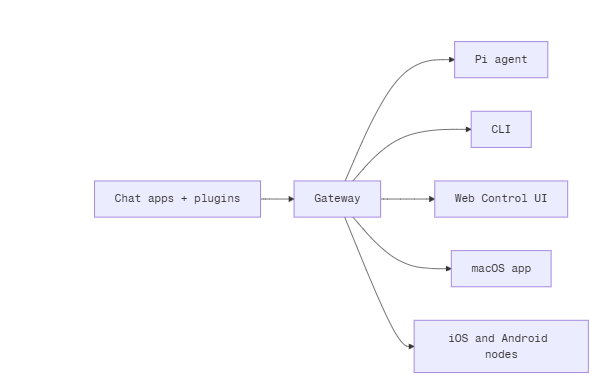

# Open Claw
## Table of Contents
- [What is OpenClaw?](#1-what-is-openclaw)
    - [What Does "Self-Hosted Gateway" Mean?](#what-does-self-hosted-gateway-mean)
    - [What Problem Does It Solve](#what-problem-does-this-solve)
- [Who is it For?](#2-who-is-it-for)
    - [Developers](#developers)
    - [Power Users](#power-users)
- [Features](#features)
    - [Channels](#1-channels)
    - [Plugins](#2-plugins)
    - [Routing](#3-routing)
- [Gateway Architecture](#gateway-architecture)
- [Agent Runtime](#agent-runtime)
    - [Overview](#overview)
## 1. What is OpenClaw?
- *“OpenClaw is a self-hosted gateway that connects your favorite chat apps – WhatsApp, Telegram, Discord, iMessage, and more – to AI coding agents like Pi.”*
### What does “self-hosted gateway” mean?
- Self-hosted = You run it on your own computer or server
- Gateway = It acts as a bridge between:
    - Your messaging apps
    - Your AI assistant
- So instead of using a company’s hosted chatbot platform, you run your own **AI bridge server**.
- Think of it like this:
`scss
WhatsApp
Telegram
Discord
     ↓
   OpenClaw (running on your machine)
     ↓
   AI Agent (like Pi, GPT, Claude, etc.)

`scss
### What problem does this solve?
- Normally:
    - AI assistants live inside specific apps
    - You’re dependent on third-party hosting
    - You don’t control your data
- With OpenClaw:
    - You message your AI from any supported chat app
    - The processing happens through your own gateway
    - You stay in control

## 2. Who is it for?
- Developers and power users who want a personal AI assistant they can message from anywhere — without giving up control of their data or relying on a hosted service.
### Developers
- People who:
    - Build AI agents
    - Want custom workflows
    - Use coding agents with tools
### Power users
- People who:
    - Want automation
    - Want their own AI assistant across platforms
    - Care about privacy & control
### Key Idea: Data Control
- Because it’s self-hosted:
    - Your chat messages are not stored by OpenClaw servers
    - You control logging, storage, routing
    - You choose which AI model to connect
## 3. What Makes It Different?
### 3.1 . Self-hosted
- Runs on your hardware, your rules
- Meaning:
    - You deploy it locally or on your server (AWS, DigitalOcean, etc.)
    - You configure API keys
    - You decide data retention
    - No vendor lock-in
### 3.2 Multi-channel
- Instead of building separate bots for:
    - WhatsApp
    - Telegram
    - Discord
- You deploy **one gateway**, and it connects to all of them.
- That means:
    - One AI brain
    - Many chat front-ends
- Very efficient architecture.
### 3.3 Agent-native
- Built for coding agents with tool use, sessions, memory, and multi-agent routing
- This is important.
- It’s not just a chatbot connector.
- It supports:
    - 🧠 Memory
    - 🔧 Tool usage
    - 🔁 Multi-agent workflows
    - 💬 Session management
- This is similar to how your ReAct + LangGraph agent:
    - Uses tools
    - Stores state
    - Manages tool calls
    - Iteratively reasons 
- OpenClaw is designed to support that kind of intelligent, tool-using AI system — not just simple Q&A bots.

### 3.4. Open Source (MIT licensed)
- This means:
    - You can modify it
    - You can fork it
    - You can use it commercially
    - The community contributes improvements
- MIT license = very permissive.
### 3.5 What Do You Need?
- Node 22+, an API key (Anthropic recommended), and 5 minutes.
#### Node 22+
- It’s built using modern JavaScript (Node.js runtime).
#### API key
- Anthropic (Claude) recommended
- Or any supported AI provider
#### 5 minutes
- Install dependencies
- Add API key
- Run server
- Connect chat apps

## Workflow Explanation

### Step 1: Chat apps + plugins → Gateway
#### What are “Chat apps + plugins”?
- These are input channels:
    - WhatsApp
    - Telegram
    - Discord
    - iMessage
    - Slack
    - Custom plugins
- They are **just interfaces**.
- They do NOT:
    - Store AI memory
    - Decide routing
    - Handle logic
- They only:
    - Receive user messages
    - Send them to the Gateway
- Think of them as front doors.
### Step 2: The Gateway (Core of the System)
- This is the most important component.
- The Gateway:
    - Receives messages from chat apps
    - Maintains session state
    - Decides which agent handles the message
    - Manages tool usage
    - Stores conversation memory
    - Routes responses back to the correct channel
- It is the **central coordinator**.

### Step 3: Gateway → Output / Consumers
#### 1. Pi Agent
- This is the AI agent itself.
- The Gateway:
    - Sends messages to the agent
    - Passes session context
    - Handles tool calls
    - Receives responses
- This agent could:
    - Use tools
    - Run code
    - Search web
    - Execute workflows
- Think of this like your ReAct-style agent — where the model:
    - Thinks
    - Calls tools
    - Responds
- The Gateway is what orchestrates that loop.

#### 2. CLI
- Command Line Interface.
- This allows you to:
    - Talk to your AI from terminal
    - Debug
    - Send commands
    - Inspect sessions
- Example:
```nginx
openclaw ask "summarize today's messages"
```
#### 3. Web Control UI
- A browser dashboard.
- Used for:
    - Viewing sessions
    - Managing agents
    - Monitoring logs
    - Debugging tool calls
    - Changing settings
- Important:
    - It does NOT store the state.
    - It only reads from the Gateway.

## Features
### 1. Channels
- *WhatsApp, Telegram, Discord, and iMessage with a single Gateway.*
#### What this really means
- OpenClaw can connect multiple messaging platforms to **one central AI brain**.
- Instead of building:
    - A WhatsApp bot
    - A Telegram bot
    - A Discord bot
    - An iMessage integration
- You connect all of them to the Gateway once.
#### Architecture implication
```markdown
WhatsApp
Telegram
Discord
iMessage
     ↓
   Gateway
     ↓
   AI Agent

```
#### Why this is powerful
- Unified memory across platforms
- No duplicated bot logic
- One AI personality everywhere
- Easier maintenance

### 2. Plugins
- *Add Mattermost and more with extensions.*
#### What are plugins here?
- Plugins are **extensible connectors or capability modules**.
- They can:
    - Add support for new chat platforms
    - Add new tool integrations
    - Add custom logic
    - Extend routing rules
#### Think of it like:
- Browser extensions
- LangChain tools
- Middleware in Express.js
#### Example
- You could write a plugin that:
    - Connects to Jira
    - Connects to GitHub
    - Connects to your CRM
    - Adds Slack support
#### Why it matters
- It prevents the core from becoming bloated.
- 
### 3. Routing
- *Multi-agent routing with isolated sessions.*
- This is one of the most advanced features.
## Gateway Architecture
### 1. “A single long-lived Gateway owns all messaging surfaces”
- **What does “long-lived” mean?**
    - The Gateway is:
        - A persistent process
        - Always running
        - Not serverless
        - Not stateless
        - Not per-request

### 2. Control-plane clients connect via WebSocket
- macOS app, CLI, web UI, automations connect over WebSocket
#### What is the control plane?
- Control plane = management layer.
- Not user chat traffic.
- These are admin / management clients.
- Examples:
    - Web dashboard
    - CLI
    - macOS companion app
    - Automation scripts
- They connect over:
```css
ws://127.0.0.1:18789
```
## Agent Runtime
### Overview
- “OpenClaw runs a single embedded agent runtime derived from pi-mono.”

### Workspace (Required)
- This is one of the most critical design decisions.
    - OpenClaw uses a single agent workspace directory as the agent’s only working directory (cwd) for tools and context.

### Bootstrap files (injected)
- These live inside your workspace directory.
#### 1. AGENTS.md
- Operating instructions + “memory”
- This is like:
    - System rules
    - Long-term instructions
    - Persistent operational memory
- It might contain things like:
```pgsql
You are a coding assistant specialized in Python and TypeScript.
Prefer concise answers.
Always use tools when file access is needed.

```
- This is persistent across sessions.
- It is injected into every new session.
#### 2. SOUL.md
- Persona, boundaries, tone
- This controls personality.
- Example:
```vbnet
Tone: Calm, precise, slightly playful.
Boundaries: Do not give medical advice.
Style: Use bullet points where helpful.

```
- This is separated from AGENTS.md intentionally.
- Why?
    - You might want to change tone without changing logic.
    - Clean separation of behavior vs personality.
#### 3. TOOLS.md
- User-maintained tool notes (e.g. img, sag, conventions)
- This is for tool usage conventions.
- Example:
```css
Use img for image generation.
Use sag for structured agent generation.
Never run shell commands without explaining why.

```
- This gives the agent guidance on how tools should be used.
- This is brilliant because:
    - You can customize tool behavior without modifying code.

#### 4. BOOTSTRAP.md
- *One-time first-run ritual (deleted after completion)*
- This is special.
- It only exists for:
    - A brand new workspace.
- Purpose:
    - Initial setup instructions
    - One-time onboarding
    - Agent self-initialization
- Example:
```pgsql
Ask the user what their preferred language is.
Create a project scaffold.
Initialize config files.

```
- After it's completed:
- You delete it.
#### 5. IDENTITY.md
- *Agent name/vibe/emoji*
- Example:
```makefile
Name: Nova
Emoji: 🌌
Vibe: Futuristic AI research assistant

```
- This allows:
    - Branding
    - Multiple personalities
    - Multi-agent setups
- Very clean separation of identity from logic.
#### 6. USER.md
- *User profile + preferred address*
- Example:
```pgsql
User name: John
Preferred address: Boss
Primary interests: AI, full-stack engineering
```
- This gives the agent user context without storing it in code.
