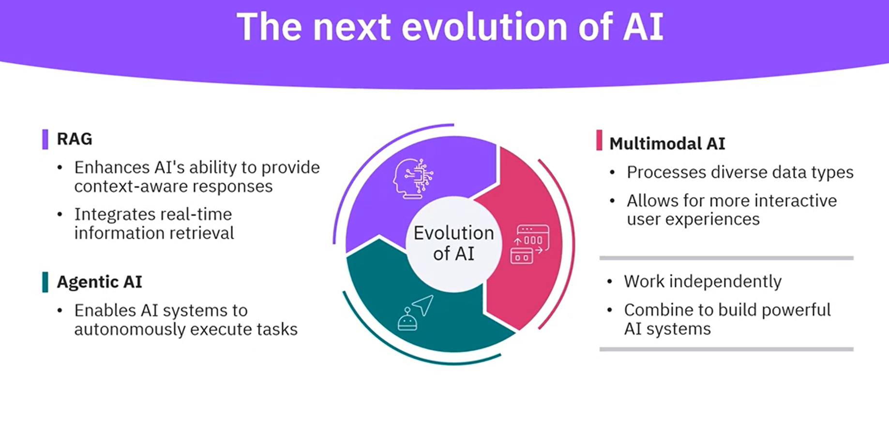
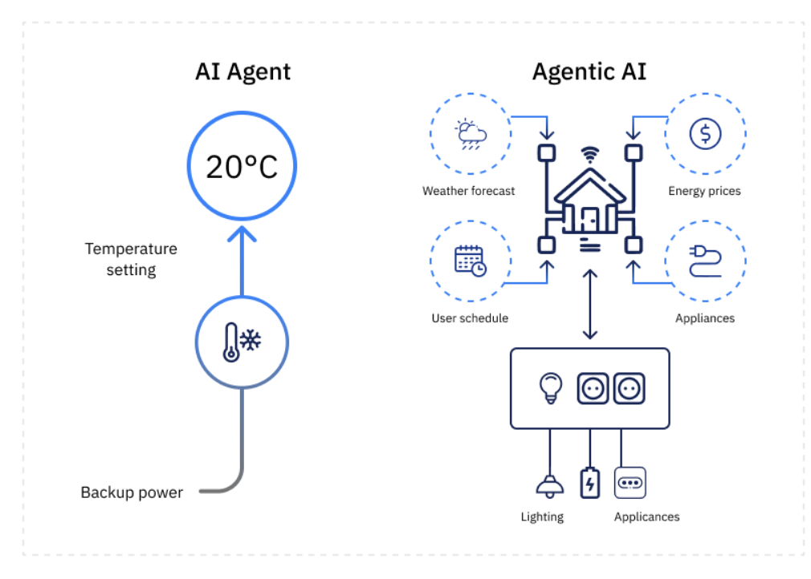
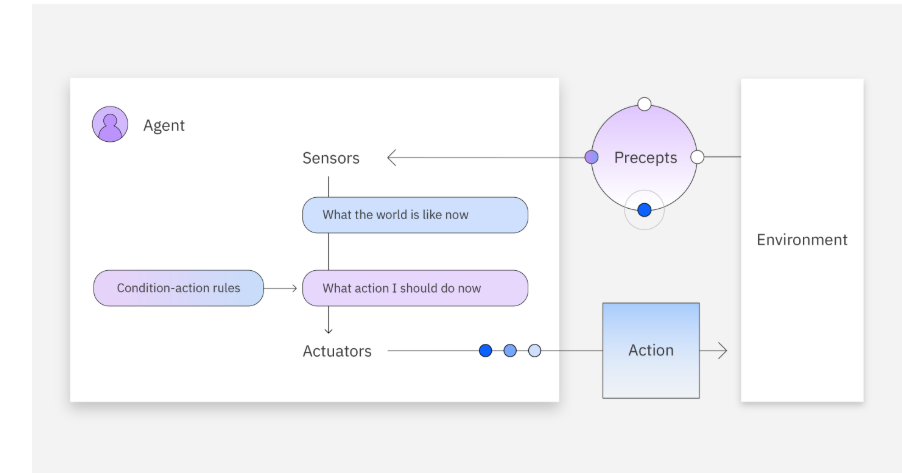
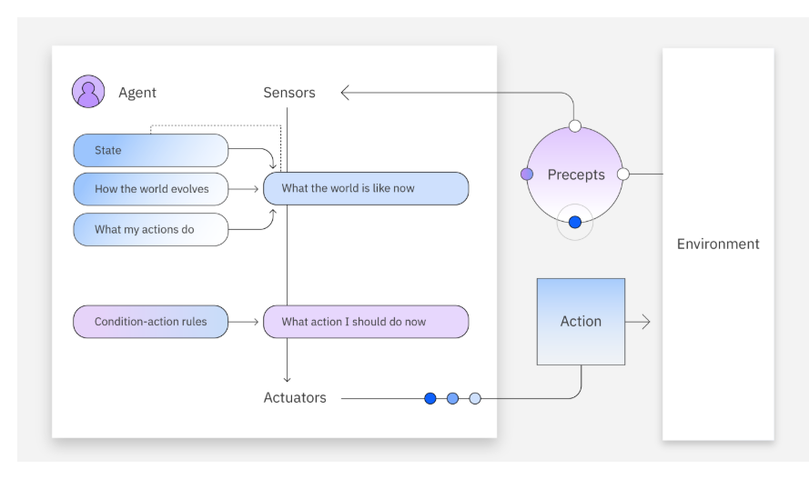
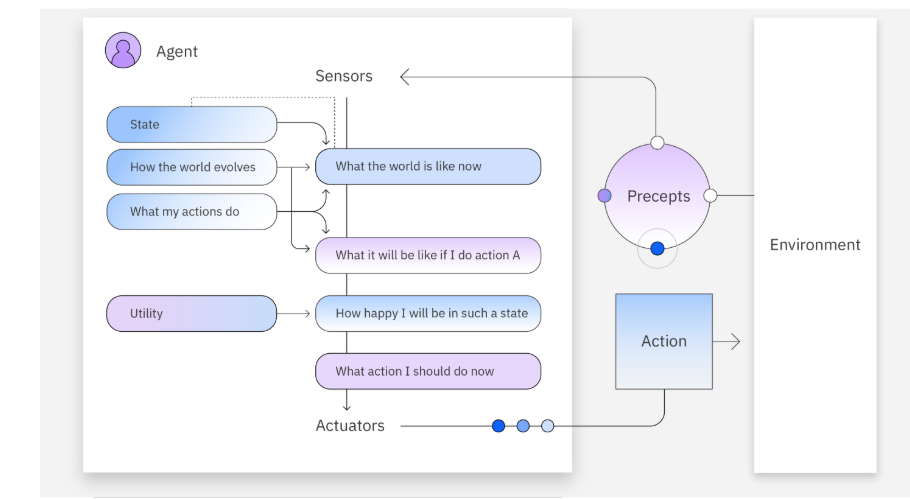
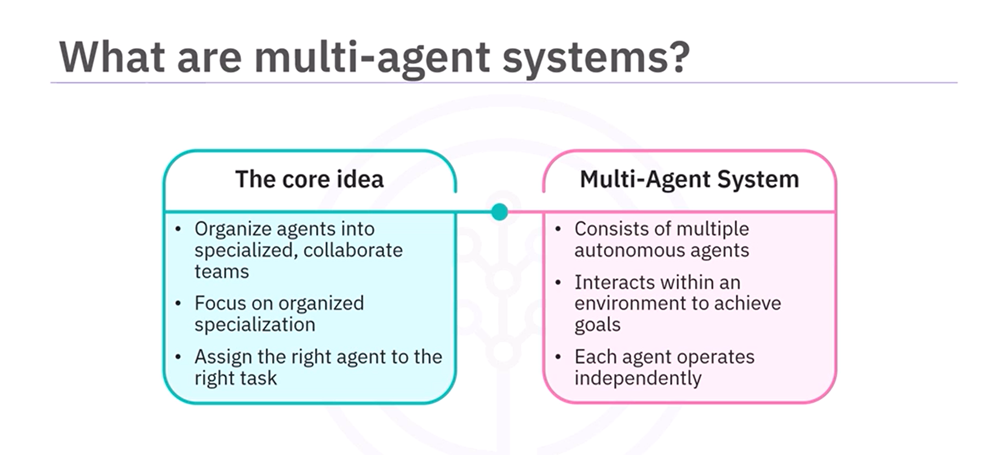
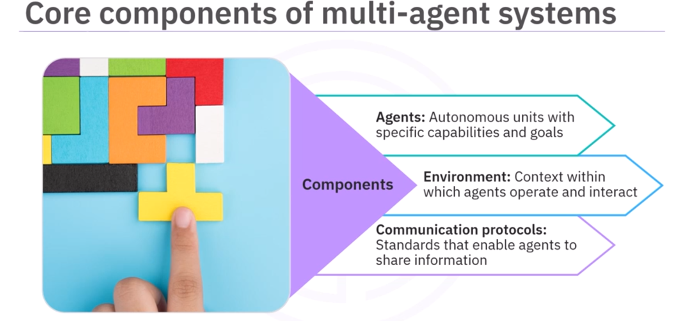

# AgentHub
## Table Of Contents
- [Overview](#1-overview)
    - [What Is An AI Agent](#what-is-an-ai-agent)
- [Agentic AI](#3-agentic-ai)
    - [What is Agentic AI](#what-are-ai-agents)
    - [Smart Home Scenario](#one-example-of-an-ai-agent)
    - [Comparison between AI Agent and Agentic AI](#comparision-between-ai-agent-and-agentic-ai)
- [The Next Generation of AI](#2-the-next-generation-of-ai)
    - [RAG](#1-rag-retrieval-augmented-generation)
    - [Agentic AI](#2-agentic-ai)
    - [MultiModel AI](#3-multimodal-ai)
- [LangChain](#2-langchain)
    - [What Is Langchain](#what-is-langchain)
    - [Key Capabilities](#️-key-capabilities)
- [LangGraph](#3-langgraph)
    - [Key Componnets](#key-components)
    - [Fundamentals](#graph-fundamentals)
    - [How to Build Graph](#graph-construction)
- [Langgraph Typical Functions](#2extra-typical-langgraph-functions)
- [Types of AI Agents](#5-types-of-ai-agents)
    - [Simple Reflex Agents](#1-simple-reflex-agents)
    - [Model Based Reflex Agents](#2-model-based-reflex-agents)
    - [Goal Based Agents](#3-goal-based-agents)
    - [Utility Based Agents](#4-utility-based-agents)
- [Summary of Types of AI Agents](#6-summary-of-types-of-ai-agents)
    - [Reflection Agents and Feedback Loop](#reflection-agents-and-feedback-loop)
    - [Prompt Engineering+LangChain/Langgraph](#prompt-engineering--langchainlanggraph)
    - [Graph Construction / LangGraph Node Design](#graph-construction--langgraph-node-design)
- [Multi-Agents](#7-multi-agents)
    - [What are Multi-Agent Systems](#what-are-multi-agent-systems)
    - [Example of Multi-Agent](#example-of-multi-agent)
    - [Why Do We Use Multi-Agents](#why-do-we-use-multi-agents)
    - [Core Components of Multi-Agent](#core-components-of-multi-agent)
    - [Reflection Agent Behavior](#reflection-agent-behavior)
- [Summary of Multi Agents](#8-summary-of-multi-agent)
- [Build Multi Agent](#9-build-multi-agent)
    - [Why Multi Agent Systems](#why-multi-agent-systems)
    - [Communication Protocols](#communication-protocols)
        - [MCP](#1-model-context-protocol-mcp)
        - [ACP](#2-ibm-agent-communication-protocol-acp)
    - [Framework Supporting Multi Agent LLM systems](#frameworks-supporting-multi-agent-llm-systems)
        - [Langgraph](#1-langgraph)
        - [Autogen](#2-autogen)
        - [Crew AI](#3-crewai)
        - [BeeAI](#4-beeai)
- [Autogen](#10-autogen)
    - [What Is Autogen](#what-is-autogen)
    - [Purpose Of Autogen](#purpose-of-autogen)
    - [Autogen Use Cases](#autogen-use-cases-1)
- [MCP](#11-mcp)
    - [What is MCP](#what-is-mcp)
        - [MCP is an Open Source Standard for Connecting AI Applications to External Systems](#1-mcp-is-an-open-source-standard-for-connecting-ai-applications-to-external-systems)
        - [Using MCP AI Applications can Connect to Data Sources Tools and Workflows](#2-using-mcp-ai-applications-can-connect-to-data-sources-tools-and-workflows)
    - [Workflows of MCP](#workflows-of-mcp)
        - [The Center: MCP (Standardize Protocol)](#1-the-center-mcp-standardized-protocol)
        - [Left Side: AI Applications](#2-left-side-ai-applications-consumers)
    - [Architecture](#architecture)
        - [MCP Architecture Workflow](#mcp-architecture-workflow)
    - [Lifecycle](#lifecycle)
        - [What Lifecycle Means](#what-lifecycle-means)
- [CRM](#13-crm)
    - [What is CRM](#what-is-crm)
    - [CRM Supports Sales & Business Operations](#crm-supports-sales--business-operations)
    - [AI And CRM](#ai-and-crm)
- [OpenClaw](#14-openclaw)

## 1. Overview
### What Is an AI Agent?
#### Simple Definition
- An AI agent is: A system that perceives its environment, makes decisions using reasoning, and takes actions to achieve specific goals.
### Core Idea of Agentic AI
#### 1. Environment
- The world the agent operates in.
- Examples:
    - A website
    - A game board
    - The internet
    - A robot’s physical surroundings
    - A database
#### 2. Perception (Sensors)
- How the agent gathers information.
#### 3. Decision / Reasoning Engine (Brain)
### Key Characteristics Explained
#### 1. Autonomy (Operates Independently)
- Traditional AI:
    - Waits for instructions
    - Executes predefined rules
- Agentic AI:
    - Can decide what to do next
    - Plans multi-step actions
    - Acts without constant supervision
#### 2. Goal-Oriented Behavior
#### 3. Reasoning & Planning
## 2. The Next Generation of AI

### Overview: “The next evolution of AI”
- The diagram describes three major pillars that define the modern evolution of AI:
1. RAG (Retrieval-Augmented Generation)
2. Agentic AI
3. Multimodal AI
### 1. RAG (Retrieval-Augmented Generation)
#### What RAG adds
- RAG connects LLMs (like GPT-4 or DeepSeek) with external knowledge sources, most commonly:
    - Vector databases (Pinecone, Chroma, FAISS)
    - Search engines (Tavily, Google, Bing)
    - Company documents
    - Internal databases
#### Benefits shown in the diagram

### 2. Agentic AI
- This is the lower-left section of the circular diagram.
- Agentic AI gives the model the ability to:
#### Autonomously execute tasks
- Instead of just answering prompts, agentic AI systems:
    - Take actions
    - Use tools
    - Call APIs
    - Search the web
    - Write files
    - Analyze data
    - Make decisions
    - Iterate on results


### 3. Multimodal AI
- This is the right side of the diagram.
- Multimodal models can process more than one type of data, such as:
    - Text
    - Images
    - Audio
    - Video
    - Code
    - Sensor data
#### Processes diverse data types
- This enables:
    - Image analysis
    - Vision + language reasoning
    - Audio transcription + meaning extraction
    - Video summarization
#### Allows for more interactive user experiences
- Examples:
    - “Analyze this screenshot and describe the bug.”
    - “Convert this image into HTML/CSS code.”
    - “Transcribe this audio and summarize key points.”
- Multimodal AI lets users interact naturally, just like humans do.

### 4. “Work independently or combine to build powerful AI systems”
- This section at the bottom explains that these components can work separately but become powerful when combined:
- Independent examples:
    - RAG alone → Chatbot with document memory
    - Agent alone → Automation (no external documents)
    - Multimodal alone → Vision model

### Putting it all together — meaning of the full diagram
- RAG → gives AI memory + factual grounding
- Agentic AI → gives AI autonomy
- Multimodal → gives AI richer perception

## 2. LangChain
### What is LangChain?
LangChain is an open-source framework that helps developers build applications powered by Large Language Models (LLMs).
Instead of coding every piece manually, LangChain provides ready-made tools, components, and APIs to:

- Connect to language models
- Manage prompts and conversations

- Link external resources (databases, APIs, files, search engines, etc.)

- Build complex workflows by chaining multiple steps together

This makes it easier to move from “just calling an LLM” to building full, production-ready AI apps.

### ⚙️ Key Capabilities
1. **Tailorable Prompts**:
- You can design prompts dynamically.

- Example: A customer support app could insert the customer’s name, order details, and conversation history into a template before sending it to the LLM.

2. **Chain Link Components**:
- LangChain allows you to connect different steps into a **chain**.
- Example: First step → clean user input → second step → query a database → third step → summarize result.
- This chaining is why it’s called LangChain.

3. **Integration with External Models and Tools**:
- It’s not limited to one LLM (like GPT).

4. **Versatile, Mix-and-Match Components**:
5. **Context Management**:

### 💡 Why it Matters
- You need **more than just a single LLM call** (e.g., multi-step reasoning, API calls, retrieval from databases).
- You want to integrate AI into real-world applications like chatbots, knowledge bases, assistants, or data pipelines.
- You’re building something **scalable and reusable** instead of quick one-off scripts.
### 🛠️ Example Applications
- **Chatbots** (customer service, Q&A)
- **Virtual Assistants** (personalized scheduling, task management)
- **Language Tools** (translation, summarization, rewriting)
- Data Apps (RAG systems where the LLM retrieves info from your database or documents)
- Sentiment/Analytics (combining LLM reasoning with ML models and dashboards)

### Key Components of LangChain
#### components & chains
- **definition**: “components” are small, focused pieces (models, prompts, retrievers, parsers). a chain wires them together so the output of one becomes the input of the next.
- **when to use**: any multi-step flow (clean → prompt → LLM → parse → store).
- **example**:
```python
from langchain_openai import ChatOpenAI
from langchain_core.prompts import ChatPromptTemplate

llm = ChatOpenAI(model="gpt-4o-mini")
prompt = ChatPromptTemplate.from_messages([
    ("system", "You are a concise assistant."),
    ("human", "Summarize:\n{text}")
])

chain = prompt | llm  # pipe operator builds a chain

chain.invoke({"text": "LangChain lets you mix & match components to build LLM apps."})

```


#### prompt templates
- **definition**: reusable, parameterized prompts that turn variables into well-structured messages (great for consistency and guardrails).
- **when to use**: you need dynamic content (user name, retrieved docs, tone, format).
- **example**:
```python
from langchain_core.prompts import ChatPromptTemplate

prompt = ChatPromptTemplate.from_messages([
    ("system", "Act as a {role}. Keep answers under {limit} words."),
    ("human", "{question}")
])

msg = prompt.format_messages(role="math tutor", limit="60", question="Explain eigenvalues.")

```

#### vector stores
- **definition**: databases that store **embeddings** (numeric vectors) for semantic search (RAG).
- **when to use**: you want the model to answer using your data (docs, tickets, wikis).
- **example**:
```python
from langchain_openai import OpenAIEmbeddings
from langchain_chroma import Chroma

emb = OpenAIEmbeddings(model="text-embedding-3-small")
vectordb = Chroma(collection_name="docs", embedding_function=emb)

# add texts
ids = vectordb.add_texts(["LangChain composes LLM apps.", "RAG adds private knowledge."])
# similarity search
docs = vectordb.similarity_search("How do I add my own data?", k=1)

```
#### example selectors
- **definition**: automatically choose few-shot examples most similar/relevant to the user’s input (boosts accuracy).
- **when to use**:tasks benefit from demonstrations (classification, style transfer, extraction).
- 
#### agents
- **definition**: runtime systems that let LLMs **use tools** (web search, code, DB) and decide which tool to call next (e.g., ReAct-style reasoning). modern LangChain pairs agents with **LangGraph** for reliability, but you can still run simple tool-using chains in pure LangChain.
- **when to use**: multi-step tasks with external actions (search → fetch → compute → answer).
- **example**:
```python
from langchain_openai import ChatOpenAI
from langchain_core.tools import tool
from langchain_core.prompts import ChatPromptTemplate

@tool
def add(a: int, b: int) -> int:
    "Add two integers."
    return a + b

llm = ChatOpenAI(model="gpt-4o-mini")
prompt = ChatPromptTemplate.from_messages([
    ("system", "You can use tools when needed. Think step-by-step."),
    ("human", "{question}")
])

# Tool-calling chain (the LLM can decide to call `add`)
chain = prompt | llm.bind_tools([add])

result = chain.invoke({"question": "What is 123 + 456?"})
# If the model calls the tool, LangChain will route, execute it, and return a final answer.

```


## 3. Langgraph

### Key Components
1. **Graph Structure**:

Think of your application as a directed graph:
- **Nodes** = **agents** (LLMs, tools, human input nodes, evaluators, etc.).
- **Edges** = **communication channels** (the path data or decisions take from one agent to another).
This setup lets you::
- Chain together specialized agents (e.g., one generates answers, another checks correctness).
- Introduce **cycles** for iterative refinement, such as a loop between a generator and a reviewer until quality criteria are met.
- Visualize workflows in a modular way, like a flowchart for AI reasoning.


2. **State Managemet**:

- A big challenge in multi-agent systems is keeping track of context across steps. LangGraph solves this with **automatic state management**:
- The **state** contains accumulated messages, facts, or metadata.
- Every time an agent acts, the state is updated — ensuring no history is lost.
- The state can be checkpointed (saved at points in the graph) and even resumed later, which makes long-running or interruptible workflows reliable.

3. **Coordination**:

- LangGraph ensures that agents run in the **right order**.
- It handles **conditional routing**, meaning an agent’s output can decide which path to follow (e.g., “If tool needed → Tool Agent, else → Planner”).
- Coordination guarantees that information exchange is seamless (no dropped messages, no out-of-sync agents).

### Graph Fundamentals
1. **State**:
- **definition**: a shared, evolving memory object that flows through your graph. Every node reads the current state and returns an **updated** state. LangGraph manages persistence/checkpoints so you can resume runs, branch, and inspect history.
- **Typical contents**:
    - `messages`: conversation history (`HumanMessage`, `AIMessage`, etc.)
    - working variables: parsed fields, IDs, partial results
    - control flags: scores, decisions, error info
- **example**:
```python
from typing import TypedDict, List, Optional
from langchain_core.messages import BaseMessage

class State(TypedDict):
    messages: List[BaseMessage]
    facts: dict
    decision: Optional[str]
```

- **TypeDict**:
    - **definition**: TypedDict lets you declare the expected keys and value types of a plain Python dict. It’s a type hint only:
    - **basic syntax**:
    ```python
    from typing import TypedDict, Literal, Optional

    class State(TypedDict):
        name: str
        mood: Literal["happy", "sorrow"]
        note: Optional[str]  # may be None

    ```
    - **usage**:
    ```python
    s: State = {"name": "Alice", "mood": "happy", "note": None}
    ```
    - **example**:
    ```python
    from typing import TypedDict, List
    from langgraph.graph import StateGraph, END

    class LGState(TypedDict):
        messages: List[str]
        decision: str | None

    def node1(s: LGState) -> LGState:
        return {**s, "messages": s["messages"] + ["node1 ran"]}

    def node2(s: LGState) -> LGState:
        # defensive access to avoid KeyError if key might be optional
        msgs = s.get("messages", [])
        return {**s, "messages": msgs + ["node2 ran"], "decision": "done"}

    g = StateGraph(LGState)
    g.add_node("node1", node1)
    g.add_node("node2", node2)
    g.set_entry_point("node1")
    g.add_edge("node1", "node2")
    g.add_edge("node2", END)

    ```
- **Dataclass**
    - **What is a Dataclass in Python?**
        - A **Dataclass** is a decorator (`@dataclass`) provided by Python’s `dataclasses` module.
        - It gives you a simple and concise way to define classes that mainly store data.
        - Instead of writing boilerplate code like `__init__`, `__repr__`, or `__eq__`, Python will auto-generate them for you.
    - **The Example Code Breakdown**
    ```python
    from dataclasses import dataclass

    @dataclass
    class DataclassState:
        name: str
        mood: Literal["happy", "sorrow"]

    ```
    - **The Example Code Breakdown**
    ```python
    from dataclasses import dataclass

    @dataclass
    class DataclassState:
        name: str
        mood: Literal["happy", "sorrow"]

    ```
    - **3. Why Use Dataclass Instead of a Dictionary?**:
    
2. **Edges & Conditional Edges**:
- **Edges** connect nodes and define execution order.
- **Conditional edges** are dynamic branches chosen at runtime from the current state.
- **Cycles** allow iterative refinement (e.g., generate → critique → revise).
- **example**:
```python
from langgraph.graph import StateGraph, END

g = StateGraph(State)
g.add_node("extract", extract_node)
g.add_node("review", review_node)
g.add_node("revise", revise_node)

def route_after_review(state: State) -> str:
    return "revise" if state["decision"] == "needs_changes" else "end"

g.set_entry_point("extract")
g.add_edge("extract", "review")
g.add_conditional_edges("review", route_after_review, {"revise": "revise", "end": END})
g.add_edge("revise", "review")  # cycle until passes review

```
3. **Tool & ToolNode**:
- Tool = any external operation: web/API call, DB query, calculator, custom Python.
- Two common ways to use tools:
    - Call tools inside your own node (most control).
    - Use `ToolNode` to automatically execute tools requested by the LLM.
- example:
```python
# 2) ToolNode pattern (LLM decides which tool to call)
from langgraph.prebuilt import ToolNode
from langchain_core.tools import tool
from langchain_openai import ChatOpenAI

@tool
def fetch_weather(city: str) -> str:
    return f"Sunny today in {city}"

tools = [fetch_weather]
llm = ChatOpenAI(model="gpt-4o-mini").bind_tools(tools)

def llm_node(state: State) -> State:
    # produce an AIMessage possibly containing tool calls
    ai_msg = llm.invoke(state["messages"])
    state["messages"].append(ai_msg)
    return state

tool_node = ToolNode(tools)  # executes pending tool calls from messages

g = StateGraph(State)
g.add_node("llm", llm_node)
g.add_node("tools", tool_node)
g.set_entry_point("llm")
g.add_edge("llm", "tools")
g.add_edge("tools", "llm")  # loop until no more tool calls

```
4. **Message Types (LangChain / LangGraph)**:
- Messages are structured data units that travel in `state["messages"]`. They capture roles and special behaviors.
    - `HumanMessage` – user input (“What’s the weather in Paris?”).
    - `AIMessage` – LLM output (text and/or tool call instructions).
    - `SystemMessage` – instructions or policy that steer the LLM (“You are a helpful assistant…”).
    - `ToolMessage` – the result of executing a tool, sent back to the LLM to continue reasoning.
    - `RemoveMessage` – instructs the runtime/memory to drop prior messages (useful for context pruning/privacy).
- Typical flow:
    - Add a `HumanMessage`.
    - LLM returns an `AIMessage` (may include a tool call).
    - A tool executes; you add a `ToolMessage` with the result.
    - LLM continues with the new context, producing the final `AIMessage`.
- example:
```python
from langchain_core.messages import HumanMessage, AIMessage, ToolMessage

state["messages"].append(HumanMessage(content="hello world"))
# -> LLM returns AIMessage with tool call
state["messages"].append(ToolMessage(tool_call_id="call-1", content="{'temp': 22}"))

```
5. **react agent**
- Now, we can extend this into a general Agent framework.
- In the Agent router, when we call the model, if it chooses to call a tool, we will return a `ToolMessage` to the user.
- But what happens if we instead pass this `ToolMessage` back into the model?
- **Agent Router**: The Agent Router is responsible for deciding what the model should do with incoming input.
    - If the model needs outside help (like using a calculator, searching the web, or querying a database), it doesn’t just respond directly — it calls a `Tool`.
    - The result of this tool call is wrapped in a `ToolMessage`, which carries the result of that action.

- **What if ToolMessage goes back to the model?** Instead of returning the raw ToolMessage directly to the user, we can feed it back into the LLM.
    - This allows the LLM to **observe the tool’s output** and then **decide the next step**.
    - This enables **multi-step reasoning** (instead of a single question–single answer cycle).
- **The ReAct Paradigm**:
    - ReAct = Reason + Act
    - It’s a general agent framework that combines tool use (actions) with LLM reasoning.
        - **act**: The model issues a command to call a tool (e.g., “search the web”).
        - **observe**: The tool returns results, which the model can read.
        - **reason**: The model thinks about the results and decides what to do next (either call another tool or respond to the user).

6. **Agent and Memory**
- Every step writes a checkpoint:
    - After each advance of the graph, LangGraph saves a **snapshot of state** plus a bit of run metadata.
- Checkpoints live inside a thread
    - A thread is one ongoing session/run (a conversation, a job, etc.). All snapshots for that run are stored on a single timeline.
- You address a run by `thread_id`
    - Pass the same `thread_id` later to resume, continue, or inspect that session.
### Why Langgraph
1. **Simplified development**
- **What it means**: You describe what should happen (nodes + edges), and LangGraph handles how to run it (order, passing messages, resuming, retries).
- **Why it’s simpler than hand-rolled logic**:

2. **Flexibility**
- **What it means**: You can compose any kind of node and route between them however you like.
- **Ways flexibility shows up**:
    - **Heterogeneous nodes**: LLM agents, tools, evaluators, vector lookups, humans (approval steps), webhooks, your own Python.
3. **Scalability**:
- **What it means**: The runtime is built to handle lots of concurrent, long-running, or complex workflows.
- How you scale in practice:
    - Checkpointing to durable storage: Swap `MemorySaver` for Redis/Postgres-backed checkpointers so any worker can resume a session by thread_id.
    - Horizontal workers: Run multiple stateless worker processes/containers pointing at the same checkpointer. Each takes a turn advancing a graph.
4. **Fault tolerance**:
- **definition**: When something fails, you don’t lose the whole run—and you can intentionally handle failures.
- **Mechanisms & patterns**:
    - **Per-node checkpoints**: On crash/restart, resume from the last finished node with the saved state.

### Graph Construction
1. **Using the `StateGraph` class**
- LangGraph provides the `StateGraph` class as a base for building graphs.
- We begin by initializing a `StateGraph` using the previously defined State class. This ensures that all nodes
2. **Adding Nodes and Edges**
- Next, we add **nodes** (functional units) and **edges** (connections that determine flow).
- Each node can represent an LLM call, an API call, or a custom function. Edges define how data flows between these nodes.
3. **Special Nodes: START and END**
- **START Node:** A special entry node that represents where the graph begins. User input or initial data is injected into the graph here.
- **END Node:** A special terminal node that indicates where the workflow finishes.
4. **Compiling the Graph**
- Once nodes and edges are added, we **compile** the graph.
- Compiling performs a **basic structure check** to ensure the workflow is valid before execution.

## 2Extra. Typical Langgraph Functions
## 3. Agentic AI
### Defining the Spectrum: From AI Agents to Agentic AI
#### What are AI Agents?
#### The Three Capabilities of AI Agents
1. **Autonomy**
- “The ability to function with minimal human intervention after initial deployment…”
- This means once you give the agent a goal, it should:
    - continue working without being manually guided
    - sense new inputs (e.g., new emails)
    - reason about the next step
    - adapt based on context
    - execute actions automatically
2. **Task-Specificity**
- “Each agent is optimized for narrow, well-defined tasks…”
- AI agents are usually **specialists**, not generalists.
- Examples of specialized agents:
    - an email triage agent
    - a database query agent
    - an RAG retrieval agent
    - 

## One example of an AI Agent

### 1. **User** → **AI Agent**
- The user asks: **“Latest AI News?”**
- This question goes into the **AI Agent** (the little robot icon on the left).
- Inside the agent, it now has a goal:
    - “Find the latest AI news and tell it to the user.”
- So the agent needs a **plan**:
    1. Search the web for AI news
    2. Read the results
    3. Summarize them
    4. Send a concise answer back
### 2. **Agent → “AI News” Search Query**
- The grey box labeled “**AI News** 🔍” is the agent deciding what tool call/search query to make.
- The agent converts the user question into a concrete action:
- This is the tool-use step of the agent.
### 3. “AI News” Query → WWW (the web)
- The **WWW icon** represents the **internet / external environment**.
- The agent (through a tool) sends the search query to the web:
    - Google/Bing/News API, etc.
- The web responds with:
    - news articles
    - titles
    - snippets
    - descriptions
- This is the **perception** step: the agent is gathering raw information from the environment.
### 4. WWW → Raw News Content
- The curved arrow from the WWW back down to the grey text box (e.g., “Tech company unveils…”)
- represents:
    - The web returns **news articles**
    - The agent receives one or more pieces of text, such as:
        - “Tech company unveils new AI chip…”
        - “Research lab releases open-source model…”
    - So now the agent has raw data, but not yet a user-friendly answer.
### 5. Raw News → AI Agent → “Answer”
- The lower half of the diagram shows the **processing and summarization**:
    - 

## Agentic AI
### What is Agentic AI
### 1. Task Decomposition
- **Meaning**:
    - Agentic AI automatically breaks a large goal into smaller, solvable subtasks.
- **Example**:
    - User says:
        - “Plan my vacation.”
    - A single-task agent might fail.
    - But an agentic system breaks it into:
        1. Book flights 
        2. Find hotels
        3. Check visa requirements
        4. Compare prices
        5. Generate itinerary
        
### 2. Inter-Agent Communication
- **Meaning**:
    - Multiple agents communicate with each other—like digital coworkers in Slack.
- **Example**
    - Flight agent → sends booked flight details to itinerary agent
    - Hotel agent → sends hotel details to pricing agent
    - Visa agent → sends visa info to scheduling agent
- **Why this matters**:
    - Allows collaborative problem solving
    - Enables division of labor
    - Allows agents to adapt based on each other's output
    - Makes the system dynamically intelligent
- **How it relates to your Reflect Agent:**
    - You currently have 1 agent (planner/reflecting agent).
    - In a multi-agent setup:
        - Task Planner → decomposes
        - Search Agent → fetches info
        - Summarizer Agent → writes summary
        - Reflection Agent → checks mistakes
    - You can easily expand into this pattern.

### 3. Memory and Reflection
#### Agentic AI can:
- **Remember past steps**:
    - (What it already tried, what worked, what failed)
- **Reflect on its output**:
    - (“Is this correct?”, “Should I fix this?”, “Should I retry?”)
- **Learn from mistakes**
    - (Internal feedback loops)
    - This turns AI from **reactive** → **self-improving**.
    - **Example**:
        - A trip planner agent remembers that:
            - You prefer morning flights
            - You dislike small hotels
            - You have no checked luggage
            - You always choose window seats
        


### Example:

- **Left: “AI Agent” (simple, single-task thermostat)**
    - On the left, we have a single AI agent that controls temperature.
        - The bottom icon (thermometer + snowflake) = **thermostat device / agent**
        - The arrow going up = the agent chooses a **temperature setting**
        - The big circle “20°C” = **the chosen target temperature**
        - “Backup power” label at the bottom just means the system stays on even if something goes wrong (simple robustness).

### Comparision between AI Agent and Agentic AI
| **Feature**          | **AI Agent**                                     | **Agentic AI**                                                        |
|----------------------|--------------------------------------------------|-------------------------------------------------------------------|
| **Design**           | One agent, one task                              | Multiple agents with distinct roles                               |
| **Communication**    | No coordination with others                      | Constant communication and coordination                           |
| **Memory**           | Stateless or minimal history                     | Persistent memory of tasks, outcomes, and strategies              |
| **Reasoning**        | Linear logic (do step A → B)                     | Iterative planning and re-planning with advanced reasoning        |
| **Scalability**      | Limited to task size                             | Can scale to handle multi-agent, multi-stage problems             |
|**Typical Applications**| Chatbots, virtual assistants, workflow helpers   | Supply chain coordination, enterprise optimization, team leaders  |

#### 1. Design
- **AI Agent — One agent, one task**
    - A simple agent:
        - Does a single job
        - Works alone
        - Has a narrow scope
        - 
- **Agentic AI — Multiple agents with distinct roles**
    - Agentic AI is like a team of AIs:
        - Planner agent
        - Research agent

## 5. Types of AI Agents
### 1. Simple reflex agents
- A simple reflex agent is the most basic and primitive form of AI agent.
- It behaves like a direct mapping from input → action, with no thinking, memory, or learning.
#### 1. A simple reflex agent is the most basic type of AI agent, designed to operate based on direct responses to environmental conditions.
- **What this means**:
    - It reacts **directly** to what it senses at the current moment.
    - It does not look at:
        - previous decisions
        - history
        - context
        - long-term consequences
- **Its core mechanism is:**
```scss
IF (condition) → THEN (action)

```
- These are called **condition–action rules**.

#### Workflow of Simple Reflex Agents

1. **Environment (Right Side)**
- This is the external world where changes happen — for example:
    - Temperature in a room
    - Traffic on a road
    - Pressure on a sensor
    - Human input
    - Surrounding objects
- The environment constantly provides **raw data**.
2. **Precepts (Sensors → Precepts Circle)**
- “Precept” = the agent’s internal representation of what it senses
- It is not the real world itself — it is what the agent perceives about the world.
- Example:
    - Temperature = 65°F
    - Car detected on lane A
    - Motion detected
    - Light level is low
- The **sensors** convert environment signals → into precepts.

3. **Sensors (left arrow from Precepts)**
- Sensors are the mechanisms the agent uses to **read** the environment.
- Examples of sensors:

### 2. Model-based reflex agents
#### What Is a Model-Based Reflex Agent? (Big Picture)
- A model-based reflex agent is the next step up from a simple reflex agent.
- A simple reflex agent:
    - Only reacts to the current input
    - Has no memory
    - Cannot understand changes over time
- A **model-based reflex agent** adds one critical improvement:
    - It maintains an internal model (memory) of how the world changes.
- This allows the agent to:
    - Track what happened earlier
    - Infer hidden information
    - Make smarter decisions
    - Handle partially observable environments

#### Workflow

- **Overview: What This Diagram Shows**
    - This diagram explains how a Model-Based Reflex Agent works internally.
    - Compared to a simple reflex agent, this one has:
        - Memory (State)
        - A model of how the world works
        - A model of how the agent’s actions change the environment
    - These extra components let the agent:
        - handle partial observability
        - remember past events
        - 
##### 1. Environment (Right Side)
- The environment sends **raw data** to sensors:
    - 
##### 2. Precepts (Purple Circle)
##### 4. Three New Internal Components Inside the Agent (the model)
- **(A) State**
    - This stores:
        - what the agent believes about the world
        - past information
        - inferred information
        - hidden information
        - things not currently observable
    - Examples:
        - The robot remembers that behind it is a wall
        - The agent remembers that it turned left last step
        - The locations of previously seen obstacles
        - A record of areas already explored
- **(B) How the World Evolves (Transition Model)**
    - This is an internal model describing:
        - how the world changes over time
        - how objects usually move
        - how conditions update

- **(C) What My Actions Do (Action Model)**

##### 5. Updating State
- The State is updated using two sources:
1. What the world is like now (current perception)
2. How the world evolves (transition model)
3. What my actions do (action model)

### 3. Goal-Based Agents
#### What Is a Goal-Based Agent?
- A goal-based agent is an AI agent that:
    - does not just react
    - does not only follow rules
    - does not only use memory
- Instead, it acts according to a **goal** — a desired future state.
- A goal tells the agent:
    - “What am I trying to achieve?”
    - “What destination/state do I want to reach?”
- 

#### Workflow of Goal-Based Agents

4. **The New Component: “What will it be like if I do action A”**
- This part is brand new (not present in simple or model-based agents).
- It represents:
    - **Prediction module**
- This module simulates different **possible actions** and predicts their outcomes.
- This enables **planning**.
- **Examples**:
    - If robot turns left → will avoid obstacle
    - If robot goes forward → may hit a wall
    - If agent chooses path X → will get closer to the goal
    - 
5. **Goals (Purple Box)**
- This is the key addition.
- The agent has a **goal** that describes a desired future state.
- Examples:
    - Reach room B103
    - Deliver package
    - Maximize battery life
- The agent evaluates predicted outcomes **relative to the goal**.
- This allows:
    - Reasoning
    - Evaluation of choices
    - Planning
    - Strategizing

6. **“What action I should do now”**
- This is where **evaluation and decision-making** happen.
- It takes two main inputs:
    - **Input 1: Goals**
        - What the agent wants to achieve
    - **Input 2: “What will it be like if I do action A?”**
        - Predicted outcomes of different possible actions

### 4. Utility-Based Agents
#### What Is a Utility-Based Agent?
- A **utility-based agent** goes beyond simply completing a goal.
- It chooses the **best** possible action by evaluating how beneficial each outcome is.
- Instead of:
    - “Does this action achieve my goal?”
- It asks:
    - “How **good** is this action compared to others?”
    - “How **good**“Which action gives me the **highest benefit**?” is this action compared to others?”
    - “Which choice yields the **best trade-off**?”
- It uses something called a **utility function**.

#### Workflow

1. **Environment → Sensors → Precepts**
- Same as previous diagrams:
2. **Internal Model (left blue blocks)**
4. **“What it will be like if I do action A”**
- Here is where **utility-based agents truly differ**.
- This block performs **future simulation**:
    - The agent simulates multiple possible actions
    - Predicts the future world for each action
    - Uses internal models to estimate outcomes
5. **"How happy I will be in such a state" — The Utility Function**
- This is the **KEY new part** in utility-based agents.
- The UTLITY FUNCTION measures:
    - **“How good is this future state for me?”**
- It assigns numerical happiness values to predicted future worlds.
- Examples of utility evaluation:
    - Safety = high utility
    - Collision risk = low utility
6. **“What action I should do now” — Decision Module**
- This module:
    - Looks at predicted outcomes
    - Looks at their utility scores
    - Selects the action with the **highest utility**
- This is the core of the utility-based decision-making.
- It chooses:
    - the **best** action
    - the **most beneficial**
7. **Actuators → Action → Environment**
- Finally:
    - The best action is executed using actuators
    - It affects the environment
    - Sensors detect new environment state
    - The cycle repeats
- This forms an **optimization feedback loop**.

## 6. Summary of Types of AI Agents
### Reflection Agents and Feedback Loop
#### Reflection agents iteratively improve AI outputs by critically analyzing their performance through a feedback loop
- Reflection agents don’t just generate answers.
- They analyze what they produced, detect flaws, and improve the answer.
- This loop looks like:
1. **Generator**: Creates an answer
2. **Reflector**: Reviews the answer
3. **Revises**: Fixes mistakes, clarifies, cites sources, etc.
- This is the fundamental principle of self-correcting AI.
#### The generator produces content while the reflector provides critical feedback
- The two roles of the agent:
    - **Generator** = Writes first draft
    - **Reflector** = Critiques and finds weaknesses

### Prompt Engineering + LangChain/LangGraph
#### Prompt Engineering with LangChain guides LLMs in content generation and structured reflection using dynamic ChatPromptTemplates and message placeholders
- LangChain lets you create:
    - Reusable templates
    - Sections for reflection
    - Slots for dynamic messages
- This structure enforces consistent behavior across steps.
#### Agent state in LangGraph is defined using MessageGraph. It tracks conversation, accumulating messages and context across iterations
- LangGraph uses **state**, which acts like memory between steps.
- The MessageGraph stores:
    - The generator's output
    - The reflector's critique
    - Tool results
    - Revised answers
- Each iteration accumulates context.

### Graph Construction / LangGraph Node Design
### Reflection Agent Behavior
#### Reflexion agents build on reflection agents by iteratively improving responses using self-critiques, external tools, and citations
- "Reflexion" = Reflection + Search Tools + Evidence
- It improves answers using:
    - Self-critique
    - External information (like Tavily)
    - Grounded citations
- This makes the responses **more accurate and fact-based**.
#### The reflection process involves a loop of generation, critique, and revision to enhance clarity, accuracy, and usefulness
- This describes the core cycle:
1. Generate
2. Critique
3. Improve
4. Repeat until good enough

#### Reflexion agents can identify and fix their own weaknesses, improving with each cycle by analyzing prior outputs
- The agent actually **detects its own mistakes**, such as:
    - Missing reasoning
    - Wrong facts
    - Logical gaps
    - Off-topic sections
- It uses this to self-correct.
#### They can incorporate real-time data by calling external tools such as web search APIs, enhancing the relevance of responses
- Reflection agents are not limited to LLM memory.
- Examples:
    - Search news (Tavily, NewsAPI)
    - Query databases
    - Fetch weather or stock info
- This ensures **up-to-date answers**.
## 7. Multi-Agents
### What are Multi Agent Systems

#### The core idea
##### Organize agents into specialized, collaborative teams
- Instead of having one single AI agent trying to do everything, tasks are **split across multiple agents**, each with its own specialization.
- Think of it like having a team:
    - A researcher agent
    - A planner agent
    - 
- They collaborate just like real human team members.

#### Multi-Agent System (Right Side)
##### Consists of multiple autonomous agents
- A MAS is made of several independent agents, each capable of:
    - Understanding instructions
    - Making decisions
    - Taking actions
    - Communicating results
- These agents are not “dumb workers.” They are **autonomous modules**.
##### Interacts within an environment to achieve goals
- Agents work inside a shared environment such as:
    - your codebase
    - the internet
    - a simulation
    - a workflow or pipeline
- They exchange information and coordinate to achieve the **final goal**.

### Team of Chiefs
#### 1. Each specializes in a different dish
- Just like real kitchens:
    - One chef specializes in desserts
    - Another specializes in meat
    - Another in sauces
    - Another in plating
- AI equivalent:
- In a multi-agent AI system:
    - A **Web Search Agent** specializes in finding information
    - A **Summarization Agent** specializes in compressing text
    - A **Reasoning Agent** specializes in logic
    - A **Coding Agent** specializes in writing code
    - A **Reflect Agent** specializes in reviewing and improving outputs
#### 2. Take on tasks too complex for a single chef
- Some meals are simply **too big or too complex** for one chef:
    - Full-course meals
    - High-volume restaurant service
    - Multi-component dishes
- A single person would:
    - be slow
    - 
#### 3. Collaborating to prepare a complete meal
- Although each chef has a separate specialty, they work together to produce a full meal:

### Why do we use Multi-Agents?

#### Challenges of a Single LLM Agent
1. **Context Overload**
- A single agent juggling retrieval, reasoning, analysis, writing, AND critique can lose track of details.
- LLMs are good, but they have limits:
    - Token limits
    - Short-term memory only
    - Need explicit instructions to “stay focused”
- When one LLM must:
    - 
    - all inside one run → it gets overloaded.
2. **Role Confusion**
- Switching between cognitive modes causes inconsistent output quality.
- An LLM that must switch between:
    - creative writing mode
    - strict logical reasoning mode
    - critical evaluation mode
    - code execution mode
3. **Debugging Difficulty**
- Hard to identify which step caused an error when all logic is inside one model.
- If a single agent:
    - reasons
    - retrieves
    - processes
    - produces output
- …in one step, you cannot see **where** the mistake occurred.
- Reasoning Agent → deduce logic
4. **Quality Dilution**
- One LLM becomes “okay” at everything but not excellent at anything.

### How Multi-Agent LLM Systems Help
#### 1. Clear responsibilities per subtasks
- Each agent has **one job**:
    - Search Agent → retrieve data
    - Reasoning Agent → deduce logic
    - Critic Agent → check errors
    - Coding Agent → generate code
    - Planning Agent → create task plan
    - Reflect Agent → improve output
#### 2. Targeted prompt engineering per agent
- 
### Core Components of Multi Agent

#### Overview: Multi-Agent Systems = Puzzle Pieces Working Together
- The image shows puzzle pieces being assembled.
- This symbolizes how agents, environment, and communication each act like a puzzle piece.
- 
#### 1. Agents — Autonomous Units with Goals & Capabilities
- Agents are the individual “workers” inside the system.
- Each agent has:
    - **Autonomy**
        - It can make decisions by itself without a human controlling every step.
    - **Capabilities**
    - **Goals**
        - Every agent is assigned a purpose:
            - A Search Agent → find information
            - A Reasoning Agent → solve a logic step
            - A Reflect Agent → evaluate and refine output
            - A Coding Agent → write or fix code
        - In your project, each "Reflect Agent" or "News Agent" is one of these units.

#### 2. Environment — The Context Where Agents Operate
- Agents cannot function in a vacuum — they need a **world** to interact with.
- The "environment" includes:
    - the task instructions
    - the available tools (e.g., code execution, web search)
    - external APIs
    - the data they work on
    - the shared memory or state
    - 
- In a multi-agent system, the environment defines:
    - What agents can see
    - What they can act on
    - How they influence each other

#### 3. Communication Protocols — How Agents Share Information
- Communication protocols define **how agents talk to each other**.
- Without communication:
    - Agents become isolated
    - Tasks can’t be coordinated
    - No final result can be assembled
- Protocols include rules such as:
    - message format
    - how to request help from another agent
    - how to pass results
    - how to resolve conflicts
    - how to coordinate steps
- In modern multi-agent AI, communication can look like:
    - JSON messages
    - LangGraph nodes passing state
    - a message queue
    - an orchestration framework (like LangChain)
    - tool calls and responses


### Example of Multi-Agent
#### Example 1: Automated Market Research Report 
- A market research report is a **complex**, **multi-step** task involving data collection, analysis, writing, reviewing, and editing.
- A single LLM can generate such a report, but the quality will be inconsistent because it must switch between:
    - research mode
    - analysis mode
    - writing mode
    - critical evaluation mode
    - editing mode
- This overload reduces accuracy and quality.
##### Workflow Breakdown (Step-by-Step)
1. **Research Agent**
- **Responsibilities**:
    - Gather data on market trends
    - Look up competitors
    - Retrieve recent news
    - Gather data from APIs, databases, and online sources
- Why this matters:
    - Market research depends heavily on **accurate data**.
    - A Research Agent focuses entirely on information retrieval without worrying about writing or analysis.

2. **Data Analysis Agent**
- Responsibilities:
    - Interpret numerical data
    - Detect growth patterns
    - Identify anomalies
    - Summarize statistical findings
- Why this matters:
    - Understanding metrics (e.g., revenue growth, market share, pricing changes) requires a different cognitive mode than writing prose or collecting data.
- A Data Analysis Agent is optimized for:
    - quantitative reasoning
    - trend extraction

#### Example 2: Customer Support Automation
##### Overview: Why Multi-Agent Customer Support Works
- Customer support is not a single-step task.
- A good support response requires:
1. Understanding what the customer is asking
2. Retrieving the correct information
3. Generating a clear, personalized reply
4. Knowing when to escalate to a human

##### Workflow Breakdown
1. Intent Detection Agent
- **What it does**:
    - This agent’s job is to **classify the user’s request** into categories such as:
        - billing
        - technical support
        - general inquiry
        - refund request
        - password reset
        - 
- **Why it matters**:
    - Correctly detecting the intent determines the **entire response pipeline**.
2. Knowledge Retrieval Agent
- **What it does**:
    - Once intent is known, this agent finds the best possible information by retrieving:
        - FAQ entries
        - help center documents
        - past ticket histories
        - knowledge base articles
        - product manuals
- **Why it matters**:
    - This ensures the system responds with **real**, **factual**, **up-to-date** answers instead of hallucinations.
- **Why a separate agent?**
    - Searching databases and retrieving exact chunks requires:
        - precision
        - selective focus
        - 

## 8. Summary of Multi-Agent
### 1. Multi-agent systems = Organized specialization
- The first bullet emphasizes the core idea:
    - **Multi-agent systems are fundamentally about putting the right agent on the right task.**
- Instead of one giant model doing everything, we break work into smaller tasks handled by specialized agents.
- A multi-agent system is:
    - **Multiple autonomous agents**
    - Each with **specific abilities**
### 2. Agent Specialization Concepts
- This part explains **how agents are designed to be different from each other**.
#### a. Capability boundaries
- Each agent must have a **clear, well-defined role**.
- Example:
    - A search agent only finds relevant sources
    - A summary agent only summarizes
    - A planner agent only breaks tasks into steps
- This prevents confusion or overlaps.
#### b. Expertise depth and breadth
- This is about balancing:
    - **Highly specialized experts** (very strong on narrow tasks)
    - **Generalist agents** (broad but less deep capabilities)
- You need both.
| **Type of Agent**                   | **Purpose**                                |
| ----------------------------------- | ------------------------------------------ |
| Expert (e.g., code generator agent) | Very accurate output for a specific domain |
| Generalist (e.g., chat agent)       | Flexible across many tasks                 |

#### c. Interface standardization
- Agents communicate through a **uniform format** (e.g., JSON schemas, typed messages, structured prompts).
- This ensures:
    - Predictability
    - Easy debugging
    - Consistent handoffs
- It’s similar to how microservices use standard APIs.

## 9. Build Multi-Agent
### Why Multi-Agent Systems? 
### Typical Multi-Agent Communication Patterns
#### 1. Sequential (Pipeline)
- **Definition**:
    - Agents work **one after another**, passing their output as the input to the next agent.
    - This is like an assembly line:
        - Agent A → Agent B → Agent C → Agent D
- **How It Works**:
    - Each agent specializes in **one stage** of the task.
    - An agent cannot begin until the previous agent finishes.
    - The flow is linear and predictable.
- **Why use it?**
    - Clear order of execution
    - Easy to trace and debug
    - Ideal for processes with well-defined stages
- **Example from the cheat sheet**
    - Research → Analysis → Writing → Review
    - A typical AI document pipeline:
    1. Research Agent
        - Collects facts or relevant context.
    2. Analysis Agent
        - Interprets or transforms what research found.
    3. Writing Agent
        - Produces the draft using the analysis.
    4. Review Agent
        - Edits, verifies quality, improves coherence.
- **Best For**:
    - document pipelines, data processing pipelines, multi-step reasoning tasks.
    
#### 2. Parallel with Aggregation
- **Definition**
    - Multiple agents **run at the same time**, and their outputs are **merged or aggregated**.
    - This looks like:
        Agent A —┐
        Agent B ——> Aggregator agent → Final output
        Agent C —┘
- **How it works**
    - Agents do **independent subtasks** simultaneously.
    - The system collects their outputs into a unified answer.
    - This massively reduces time when subtasks don’t depend on each other.
- **Why use it?**
    - Speed
    - Redundancy
    - Multiple perspectives
- **Examples**:
    - SEO analysis, fact-checking, writing run in parallel
    - **SEO Agent** → extracts keywords
    - **Fact-check Agent** → verifies claims
    - **Writing Agent** → drafts paragraphs
    - Then, **Aggregator Agent** merges all contributions into one final document.
#### 3. Interactive Dialogue
- **Definition**
    - Agents **talk to each other** iteratively, exchanging messages to clarify, negotiate, or improve the result.
    - This is similar to:
        - Agent A ↔ Agent B ↔ Agent C
        - (repeating until a consensus is reached)

- **How It Works**:
    - Agents ask questions or challenge each other’s outputs.
    - Useful when tasks are ambiguous or require refinement.
    - Produces more accurate or creative answers.
- **Why Use It**:
    - Emergent reasoning
    - Error correction
    - Collaborative decision-making
- **Example**:
    - Requirements agent queries data agent before finalizing

### Communication Protocols
#### 1. Model Context Protocol (MCP)
##### **What it is**
- MCP is a **JSON-RPC–based protocol** that allows LLMs to interact with external tools, services, and data sources.
- It is created by **Anthropic** and used widely across agent ecosystems.
##### **Why it exists**:
- LLMs need safe and structured ways to call:
    - tools
    - APIs
    - databases
    - external systems
    - file systems
    - computation services
    - custom plugins
- MCP gives a **universal standard** so an LLM can invoke tools in a predictable way instead of relying on ad-hoc prompts.
##### **How MCP works**
- The agent sends a **JSON-RPC request** describing an action.
- A tool host receives the request.
- The host performs the action.
- The result is returned to the agent.
- Example conceptually:
```json
{
  "jsonrpc": "2.0",
  "method": "run_tool",
  "params": {
    "tool": "weather_api",
    "location": "San Francisco"
  },
  "id": 1
}

```
- The tool replies:
```json
{
  "jsonrpc": "2.0",
  "result": { "temperature": "18°C" },
  "id": 1
}

```
- **Key Benefits**
    - Modular
        - Tools can be swapped in/out without changing the agent.
    - Real-time collaboration
        - LLMs can call tools during reasoning, not just at the end.
    - Safe
        - Tools execute only predefined operations (e.g., search, fetch, compute).
    - Better than prompt-hacking
        - Instead of saying:
            - “Assume you are a calculator. Please compute…”
        - The agent **calls an actual calculator tool** via MCP.
- **Where MCP is used**
    - Anthropic Claude tools
    - Multi-agent systems needing tool access
    - Agent-based IDEs (cursor, windsor.ai, etc.)
    - Automations requiring external API calls
    - RAG pipelines connecting LLMs to storage & search tools

#### 2. IBM Agent Communication Protocol (ACP)
##### What it is
- ACP is IBM’s enterprise protocol for **standardized message exchange among autonomous agents**.
- It is designed specifically for:
    - enterprise-scale agent systems
    - secure communication
    - structured message passing
    - long-running workflows
- ACP is part of **IBM’s Agentic AI architecture** (used in BeeAI in your previous table).
##### Why ACP exists
- Enterprises need:
    - clear message contracts
    - strict security
    - audit trails
    - 
##### How ACP works
- ACP defines:
    - standardized **message formats**
    - routing rules
    - delivery guarantees
    - authorization layers
    - agent identity management
    - lifecycle management of agent messages
- Messages between agents look like:
```json
{
  "sender": "DataAgent",
  "receiver": "PlannerAgent",
  "timestamp": "...",
  "intent": "REQUEST_DATA",
  "payload": {
    "query": "find revenue growth for Q3"
  }
}

```
##### Key benefits
- **Enterprise security**
    - Authentication
    - Authorization
    - Access control
    - Logging
- **Scalability**
    - ACP supports **thousands of agents running across distributed systems**.
- **Reliability**
    - Guaranteed delivery
    - Message ordering
#### Comparison Summary
| **Protocol** | **Purpose**                                | **Strength**                            | **Use Cases**                  |
| -------- | ------------------------------------------ | --------------------------------------- | ------------------------------ |
| **MCP**  | Let LLMs call external tools safely        | Lightweight, modular, easy to integrate | Tools, RAG, APIs, plugins      |
| **ACP**  | Enterprise agent-to-agent message exchange | Secure, auditable, enterprise-scale     | Multi-agent enterprise systems |

### Frameworks Supporting Multi-Agent LLM Systems
#### 1. LangGraph
- **Focus/Features**
    - Graph-based orchestration, shared state, dynamic routing
- **What this means**
    - LangGraph (by LangChain) is currently the most popular framework for building multi-agent and agentic RAG systems.
    - It treats agents as **nodes in a graph**, and data (state) flows between nodes.
- **Key advantages**
1. Graph-based orchestration
2. Shared State
3. Dynamic Routing
- Ideal for:
    - Agentic RAG
    - Multi-step reasoning
    - Complex workflows
    - Production-level pipelines (chatbots, assistants)
#### 2. AutoGen
- Focus/Features
    - Agent self-organization, negotiation, adaptive collaboration
    - AutoGen (by Microsoft) is built around **conversation-driven agent collaboration**.
- **Key capabilities**:
1. **Self-organization**
- Agents decide by themselves:
    - who should speak
    - when to stop
    - how to collaborate
    - when to bring in new tools
- Agents negotiate like a team.
2. **Negotiation Mechanism**
- 
#### 3. CrewAI
#### 4. BeeAI
#### Summary Table
| **Framework** | **Strength**                        | **Best For**                             |
| ------------- | ----------------------------------- | ---------------------------------------- |
| **LangGraph** | Graph workflows + shared state      | RAG pipelines, agent orchestration       |
| **AutoGen**   | Negotiation + conversation loops    | Collaborative reasoning, code generation |
| **CrewAI**    | Typed interfaces + strict workflows | Enterprise apps, reliable data pipelines |
| **BeeAI**     | Enterprise orchestration + IBM ACP  | Large-scale corporate AI deployments     |

## 10. Autogen
### What is Autogen

- AutoGen is an open-source framework for building multi-agent AI applications.
    - Think of AutoGen as a toolbox + runtime system allowing you to create groups of AI agents that:
        - Communicate with each other
        - Collaborate on tasks
- In short:
    - AutoGen lets you create AI systems where many LLM-based agents operate like a team.

### Purpose of AutoGen
- **Communicate naturally**
    - Agents talk using **natural language messages**—similar to ChatGPT conversations but between agents.
- **Cooperate to solve tasks**
    - For example:
        - Research agent finds information
        - Coding agent writes code
        - Debug agent fixes errors
        - Planner agent coordinates everything
- **Perform tasks together**
    - Retrieve data
    - Run Python code
    - Search the web
    - Split work across multiple agents
    - Handle complex workflows end-to-end
### AutoGen Use Cases
- AutoGen is designed for any system where multiple agents need to work together, including:
#### Automated workflows
- E.g.:
    - End-to-end document processing
    - Automated content generation pipelines
    - Financial report generation
#### Multi-agent collaboration
- E.g.:
    - A “writer” agent + “editor” agent
    - A “researcher” agent + “summarizer” agent 

#### Dynamic task solving
- Agents adapt to new goals live and respond with custom actions.

#### Tool-using agents
- Agents can:
    - Run Python code
    - Use APIs
    - Query databases
    - Call external services
- This makes AutoGen extremely useful for **agentic AI development**.

### AutoGen’s 4 Major Components
#### 1. AutoGen Studio
- *A no-code graphical interface for designing and testing multi-agent workflows.*
- Think of it as:
    - A visual builder
    - Drag-and-drop interface
    - A sandbox to design, debug, and deploy agent workflows
- You can visually create systems like:
    - Planner → Researcher → Summarizer
    - User → Coding Agent → Debug Agent
- No Python code required.

#### 2. AutoGen AgentChat
- *A simplified API for building conversational single-agent and multi-agent applications.*
- This is the **fastest way to create agents**.
- Features:
    - Simple interfaces (`AssistantAgent`, `UserProxyAgent`, etc.)
    - Pre-built multi-agent loops
    - Automatic message passing
    - Conversation logging
- It supports building:
    - Q&A chatbots
    - Assistant bots
    - Multi-agent chat loops
    - Debug conversations
    - Customer service agents

#### 3. AutoGen Core
- *The foundational API for scalable multi-agent AI systems.*
- This is the **low-level engine** of AutoGen.
- It includes:
    - Custom agent definitions
    - Custom message passing
    - Workflow orchestration
    - Fine-grained multi-agent routing
    - Tool use integration
    - Event-driven architecture
- You choose **when**, **how**, and **why** agents speak to each other.
#### 4. AutoGen Extension
- *A library of first-party and third-party plugins that extend AutoGen.*
- Extensions include:
    - Integrations with APIs
    - Tools like Tavily search
    - Code executors
    - RAG pipelines
    - Specialized agents (e.g., research, summarizer, planner)
### AutoGen Use Cases
#### 1. Code generation, execution, and debugging
- **What this means**
    - AutoGen can create agents that:
        - Write code
        - Run the code
        - Check results
        - Debug issues
        - Try again automatically
    - Agents can coordinate to produce correct code through iterative refinement.
#### 2. Multi-agent collaboration
- **What this means**
    - Multiple agents work together like **a team of specialists**:
        - Researcher
        - Writer
        - Planner
        - Evaluator
        - Critic
        - Coder
        - Summarizer
    - Each agent handles part of the workflow.
- **Example**
    - For a News Agent:
        - **SearchAgent** → fetches articles
        - **SummarizerAgent** → writes summary
        - **CriticAgent** → ensures clarity
- **How YOU can use this**
    - Your projects can easily adopt this pattern:
        - **Reflect Agent**: Reflector Agent + Analyzer Agent
#### 3. Sequential multi-agent chats
- **What this means**
    - AutoGen can force agents to talk in a **specific order**.
    - This is useful for workflows, pipelines, and step-by-step reasoning.


## [11. MCP](mcp_concepts.md)
## 13. CRM
### What is CRM
- **Customer Relationship Management (CRM)** is:
    - A set of integrated technologies used to document, track, and manage an organization’s relationships and interactions with current and potential customers.
- **What does this mean?**
    - CRM systems help businesses:
        - Store customer information
        - Track communications (emails, calls, meetings)
        - Manage leads (potential customers)
        - Monitor sales pipelines
        - Improve customer service
    - Instead of using spreadsheets or scattered notes, everything is organized in one system.
### CRM Supports Sales & Business Operations
- The image mentions that CRM supports the sales process and helps advance enterprise resource planning (ERP).
#### Sales Support
- CRM helps sales teams:
    - Track leads from first contact to final sale
    - See where each prospect is in the pipeline
    - Monitor deal progress
    - Forecast future sales
- This improves:
    - Lead generation control
    - Pipeline visibility
    - Revenue prediction accuracy
#### ERP Connection
- ERP systems manage:
    - Inventory
    - Accounting
    - Operations
    - Supply chain

### AI and CRM
#### Why AI + CRM Is Important
- Traditional CRM systems mainly:
    - Store customer data
    - Track sales
    - Manage contacts
- AI-powered CRM goes further:
    - Learns from data
    - Predicts behavior
    - Automates decisions
    - Personalizes customer experiences
- Modern customers expect:
    - Fast responses
    - Personalized recommendations
    - Seamless communication
- AI CRM helps businesses deliver that.

#### What Is AI CRM?
- AI CRM combines:
    - The power of Artificial Intelligence + Traditional CRM tools
- **Traditional CRM Handles:**
    - Contact management
    - Lead tracking
    - Sales pipeline
    - Email logs
    - Call tracking
- **AI Adds:**
    - Predictive analytics
    - Automation
    - Pattern recognition
    - Smart recommendations
    - Customer sentiment analysis
    - Intelligent chatbots
- So instead of just storing data, the system thinks and suggests actions.

#### Predictive Analytics – The Key Contribution
- The image highlights predictive analytics as one of the best AI contributions.
- **What is Predictive Analytics?**
    - It uses:
        - Historical data
        - Customer behavior
        - Machine learning models
    - To predict:
        - Who is likely to buy
        - When a customer might churn
        - Future sales revenue
        - Best marketing targets
        - Most profitable demographics

#### Enhanced Data Analysis
- AI CRM enhances data analysis by:
- **Analyzing**
    - Purchase history
    - Browsing behavior
    - Email engagement
    - Support ticket patterns
    - Social media interactions
- **Generating Insights:**
    - Customer lifetime value (CLV)
    - Churn probability
    - Optimal pricing strategies
    - Campaign effectiveness
    - Demographic targeting

## [14. OpenClaw](openclaw/readme.md)